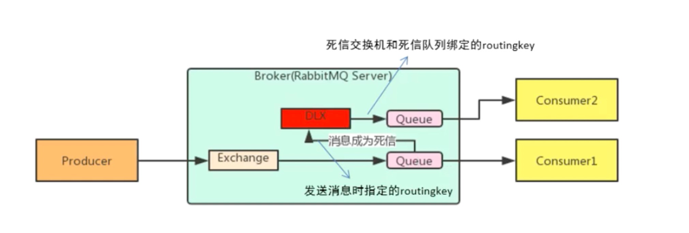
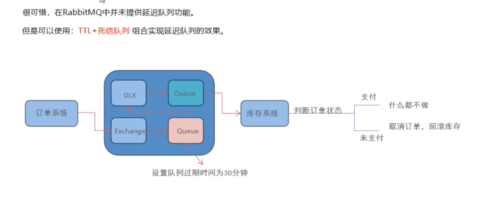

# 什么是消息中间件

消息(Message)是指应用内间传递的数据

消息队列中间件(Message Queue Middleware, 简称MQ)
# 消息中间件的作用

- 解耦
- 冗余
- 扩展性
- 削峰
- 可恢复性
- 顺序保证
- 缓冲
- 异步通信

# 死信队列

## 消息在什么情况下会成为死信
- 队列长度达到限制
- 消费者拒接消息
- 源队列存在消息过期设置, 超时未被消费

## 队列绑定死信交换机
给队列设置`x-dead-letter-exchange`和`x-dead-letter-routing-key`

# 如何实现延迟队列
TTL限制+死信队列

1. 设置一个没有消费者的queue, 并设置该队列的TTL, 并绑定一个死信队列
2. 当TTL超时后, 消息被转到死信对了, 此时就实现了延时的效果
*利用TTL实现延时*

# 消息追踪
- firehose
- 
